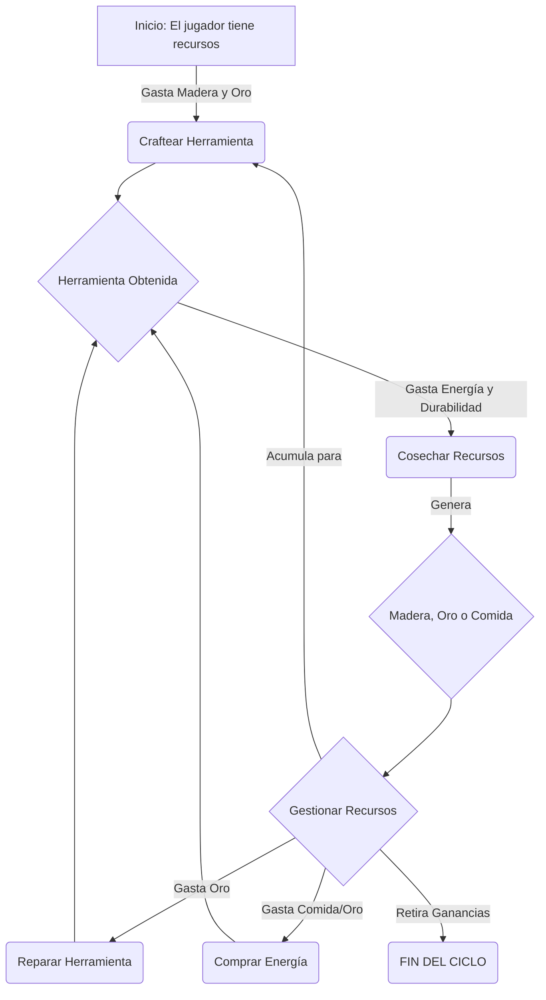

## **Documento de Diseño de Juego (GDD): Farmer's World**

### 1. Resumen del Juego (Concepto General)

**Farmer's World** es un juego de simulación económica y gestión de recursos basado en blockchain. Los jugadores invierten recursos para fabricar herramientas, que luego utilizan para recolectar más recursos. El núcleo del juego es un ciclo de **inversión, cosecha y mantenimiento**, donde los jugadores deben gestionar estratégicamente su **Energía**, la **Durabilidad** de sus herramientas y sus saldos de tokens para maximizar sus ganancias.

El juego se compone de tres recursos principales: **Madera (Wood)**, **Oro (Gold)** y **Comida (Food)**, cada uno asociado a un tipo de herramienta específico.

### 2. Bucle de Juego Principal (Core Loop)

El motor del juego es un ciclo continuo que los jugadores repiten para progresar y obtener ganancias.

1.  **CRAFTEAR**: El jugador gasta **Madera** y **Oro** para fabricar una nueva herramienta.
2.  **COSECHAR**: El jugador gasta **Energía** y la **Durabilidad** de su herramienta para recolectar recursos. La cantidad de recursos obtenidos depende del tiempo transcurrido desde la última cosecha.
3.  **GESTIONAR**: El jugador utiliza los recursos obtenidos para:
    *   **Reparar** sus herramientas (gastando Oro).
    *   **Comprar** más Energía (gastando Comida u Oro).
    *   **Acumular** para fabricar más herramientas.
    *   **Retirar** sus ganancias del juego.

### 3. Recursos y Activos del Juego

#### A. Recursos Primarios (Tokens del Juego)
*   **Madera (Wood)**: Recurso básico utilizado principalmente para craftear herramientas.
*   **Oro (Gold)**: Recurso "premium" utilizado para craftear, reparar herramientas y comprar energía.
*   **Comida (Food)**: Recurso utilizado para reponer la energía del jugador.

#### B. Atributos del Jugador
*   **Energía (Energy)**: Se consume al realizar la acción de `harvest`. Es el principal limitante de las acciones por período de tiempo. Se puede reponer gastando recursos.
*   **Energía Máxima (Max Energy)**: El límite superior de energía que un jugador puede acumular.

#### C. Herramientas (Activos del Jugador - Potenciales NFTs)
Las herramientas son los activos principales que permiten a los jugadores interactuar con el bucle de cosecha. Existen tres categorías, una para cada recurso: `woodTools`, `goldTools`, y `foodTools`.

*   **Atributos de la Plantilla de Herramienta (Definidos por Nivel)**:
    *   `energyConsumption`: Cuánta energía consume la herramienta por uso.
    *   `durability`: La durabilidad máxima de la herramienta.
    *   `durabilityConsumption`: Cuánto se desgasta la herramienta por uso.
    *   `chargeTime`: El tiempo (en segundos) que tarda la herramienta en "cargarse" completamente para dar la máxima recompensa.
    *   `rewardRate`: La cantidad máxima de recursos que se obtienen en una cosecha con carga completa.

*   **Atributos de la Herramienta del Usuario (Instancia Única)**:
    *   `lvl`: El nivel de la herramienta.
    *   `durability`: La durabilidad actual de la herramienta.
    *   `lastHarvest`: El timestamp de la última vez que se usó para cosechar, clave para calcular la recompensa.

### 4. Mecánicas Detalladas

*   **Crafteo (`craft`)**:
    1.  El jugador elige qué tipo de herramienta y de qué nivel desea fabricar.
    2.  El sistema verifica el costo en Madera y Oro consultando `toolContract.getToolCost()`.
    3.  Se descuentan los recursos del saldo del jugador.
    4.  Se crea una nueva instancia de la herramienta para el jugador (`toolContract.addUserTool()`) con su durabilidad al máximo y su `lastHarvest` inicializado al momento del crafteo.

*   **Cosecha (`harvest`)**:
    1.  El jugador elige qué herramienta específica usar.
    2.  **Validaciones**:
        *   La herramienta debe existir.
        *   La durabilidad actual debe ser mayor que el costo de durabilidad por uso.
        *   El jugador debe tener suficiente energía.
    3.  **Costos**:
        *   Se reduce la energía del jugador.
        *   Se reduce la durabilidad de la herramienta y se actualiza su `lastHarvest` a `block.timestamp`.
    4.  **Cálculo de Recompensa**:
        *   Se calcula el `timePassed` desde `lastHarvest`.
        *   Si `timePassed >= chargeTime`, el jugador recibe la recompensa completa (`rewardRate`).
        *   Si `timePassed < chargeTime`, el jugador recibe una recompensa proporcional al tiempo transcurrido. Esto incentiva a los jugadores a esperar el tiempo óptimo en lugar de cosechar constantemente.
    5.  Se añade la recompensa al saldo del recurso correspondiente del jugador.

*   **Reparación (`repair`)**:
    1.  El jugador elige una herramienta y la cantidad de Oro que desea gastar.
    2.  El Oro se convierte en puntos de durabilidad según una tasa de conversión definida en `tokenRelation.goldToEndurance`.
    3.  Se añade la durabilidad a la herramienta, sin exceder su máximo.
    4.  Se descuenta el Oro del jugador.

*   **Comprar Energía (`buyEnergy`)**:
    1.  El jugador gasta Oro para comprar Energía.
    2.  El Oro se convierte en Energía según la tasa `tokenRelation.foodToEnergy`.
    3.  **Nota**: Existe una inconsistencia aquí. La variable se llama `foodToEnergy`, pero la función usa Oro. Lógicamente, debería usarse Comida.

### 5. Roles y Administración

*   **Jugador (Player)**: El usuario final que interactúa con las mecánicas del juego.
*   **Propietario/Administrador (Owner/Contract Caller)**: Un rol con privilegios elevados que puede:
    *   Añadir y modificar los tipos de herramientas y sus costos.
    *   Ajustar las tasas de conversión de la economía (ej. `goldToEndurance`).
    *   Editar directamente el estado de un jugador o sus herramientas, funcionando como un "Dios" del juego.

### 6. Puntos a Considerar y Posibles Mejoras

1.  **Error en `getAllUserTools`**: La función en `Tools.sol` inicializa un array de tamaño fijo (`new UserTools`). Si un jugador tiene más de 10 herramientas, la llamada fallará. Debe ser un array dinámico.
2.  **Riesgo en la Creación de IDs**: La función `craft` calcula el nuevo ID de la herramienta como `maxId + 1`. Esto es peligroso si se implementa una función para eliminar herramientas, ya que los IDs podrían reutilizarse y causar conflictos. Sería más seguro usar un contador incremental simple (`_toolCount`).
3.  **Función `deleteTool` Inexistente**: Hay un comentario para una función de eliminar/quemar herramientas, pero no está implementada. Esto es clave para la gestión de activos.
4.  **Centralización**: El rol de `owner` tiene un control absoluto sobre la economía y los datos de los usuarios, lo cual es un riesgo de centralización significativo que los jugadores deben conocer.

